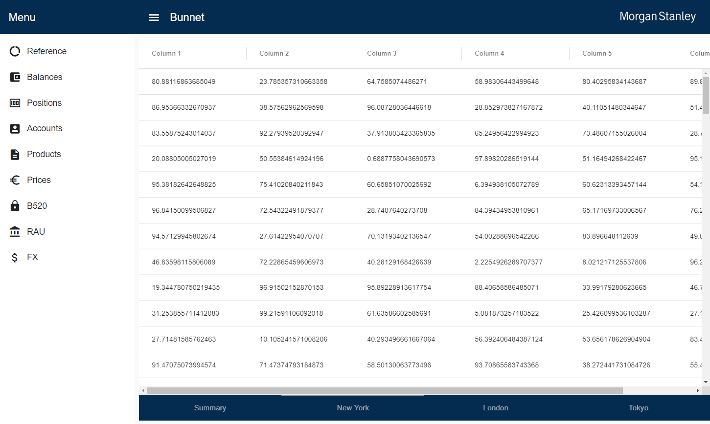

# Bunnet

Bunnet is just a small little idea to see how I can visualise flat files to provide a uniform searching and querying tool for the common construct. What exists in this repository is just me playing around with this idea amongst other things including seeing if a Morgan Stanley material theme would look good and learning a bit more about websockets in the world of Spring.

Icons made by <a href="https://www.flaticon.com/authors/smashicons" title="Smashicons">Smashicons</a> from <a href="https://www.flaticon.com/" 			    title="Flaticon">www.flaticon.com</a> is licensed by <a href="http://creativecommons.org/licenses/by/3.0/" 			    title="Creative Commons BY 3.0" target="_blank">CC 3.0 BY</a>
